<!-- README.md is generated from README.Rmd. Edit that file, then re-render
     with devtools::build_readme(). Do not edit README.md by hand. -->

# Applr

A small R package for visualizing linear models. Plots anything from
simple lines to high-dimensional squiggles all with the same functions.

Start by fitting an `lm()`, then hand it to Applr. Explore it with
`autoplot()`, or present it with polish and fine-grained control using
`geom_slice()`. Either way, you can trust the linear model, because you
can see it and control it - something `geom_smooth()` attempts, but
can’t reach.

Also includes label helpers (`geom_slice_subtitle()`,
`geom_slice_text()`), base-R plots (`slice_2d()`), interactive 3-D
surfaces (`scatter_3d()`), LaTeX generator (`lm_latex()`), and a simple
diagnostic helper (`diagnose()`).

Perfect for any **App**lied **l**inear **r**egression.

## Installation

``` r
install.packages("devtools")      # if you don’t have it
devtools::install_github("saundersg/Applr")
library(Applr)
```

## Quick start

``` r
library(Applr)

# One call: scatter + fitted line + label from any lm()
model <- lm(mpg ~ qsec + am, data = mtcars)
autoplot(model)

# Or build the plot yourself with a geom_slice() layer
library(ggplot2)
ggplot(mtcars, aes(qsec, mpg, color = am)) +
  geom_point() +
  geom_slice(model) +
  geom_slice_subtitle()
```


Both report helpful messages to the console about what decisions it
made, and how you can control those decisions.

------------------------------------------------------------------------

## `autoplot.lm` — a complete plot in one call

See your model instantly and iterate easily to find the right model.
`autoplot()` on an `lm` builds the whole plot: the model’s own data as a
scatter, a fitted `geom_slice()` line with confidence ribbons, and a
subtitle that communicates what the model is. To help with iteration,
`summary()` is also printed to the console, showing P-values, R^2, and
other statistics (override with `summary = FALSE`).

The result is a regular ggplot you can extend with `mapping` and `+` as
usual.

``` r
autoplot(lm(Petal.Length ~ Sepal.Length + I(Sepal.Length^2):Species, iris))
#> 
#> Call:
#> lm(formula = Petal.Length ~ Sepal.Length + I(Sepal.Length^2):Species, 
#>     data = iris)
#> 
#> Residuals:
#>      Min       1Q   Median       3Q      Max 
#> -0.72665 -0.15039  0.00562  0.16639  0.76639 
#> 
#> Coefficients:
#>                                     Estimate Std. Error t value Pr(>|t|)    
#> (Intercept)                         -3.79412    1.09932  -3.451 0.000731 ***
#> Sepal.Length                         2.04477    0.36389   5.619 9.51e-08 ***
#> I(Sepal.Length^2):Speciessetosa     -0.19763    0.02958  -6.680 4.75e-10 ***
#> I(Sepal.Length^2):Speciesversicolor -0.11503    0.03033  -3.793 0.000218 ***
#> I(Sepal.Length^2):Speciesvirginica  -0.09427    0.02987  -3.156 0.001944 ** 
#> ---
#> Signif. codes:  0 '***' 0.001 '**' 0.01 '*' 0.05 '.' 0.1 ' ' 1
#> 
#> Residual standard error: 0.262 on 145 degrees of freedom
#> Multiple R-squared:  0.9786, Adjusted R-squared:  0.978 
#> F-statistic:  1655 on 4 and 145 DF,  p-value: < 2.2e-16
```

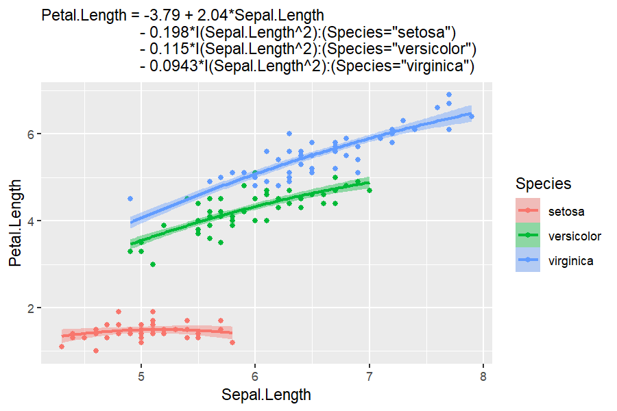

`autoplot` makes a few decisions for you, but lets you control them. The
model’s first numeric predictor goes on the x-axis, and subsequent
predictors group by `color`, then `facet_wrap()`, and `linetype`.
Override or add to the automatic `aes()` by passing a `mapping`. Choose
a different x-axis predictor with `aes(x = ...)`, and pass other
aesthetics such as `color`. Everything else in `...` is passed on to
`geom_slice()` or `geom_slice_subtitle()`. Pass
`interval = "prediction"` for the wider ribbon, or `interval = "none"`
for a bare line.

``` r
model <- lm(hwy ~ displ + drv + cyl, data = mpg)

# Change the defaults like a normal ggplot; it will still infer the rest
autoplot(model, aes(color = factor(cyl))) + facet_wrap(~drv)
```

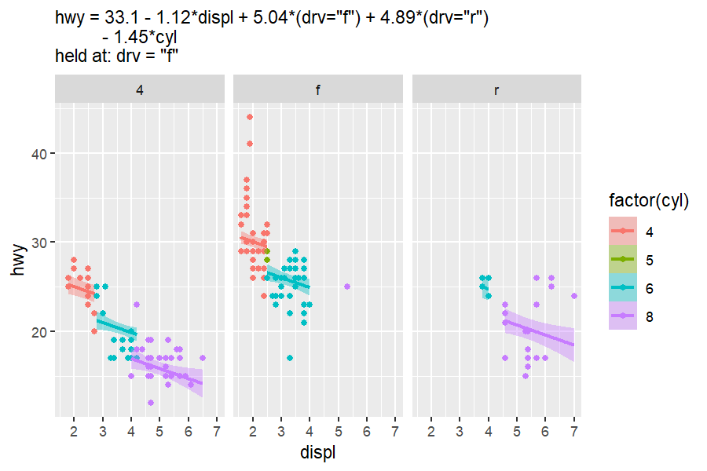

``` r

# Pass geom_slice() options through
autoplot(model,
         aes(x = cyl, color = factor(drv)),
         interval = "none") +
  labs(title = "The Same Model From a Different Angle")
```

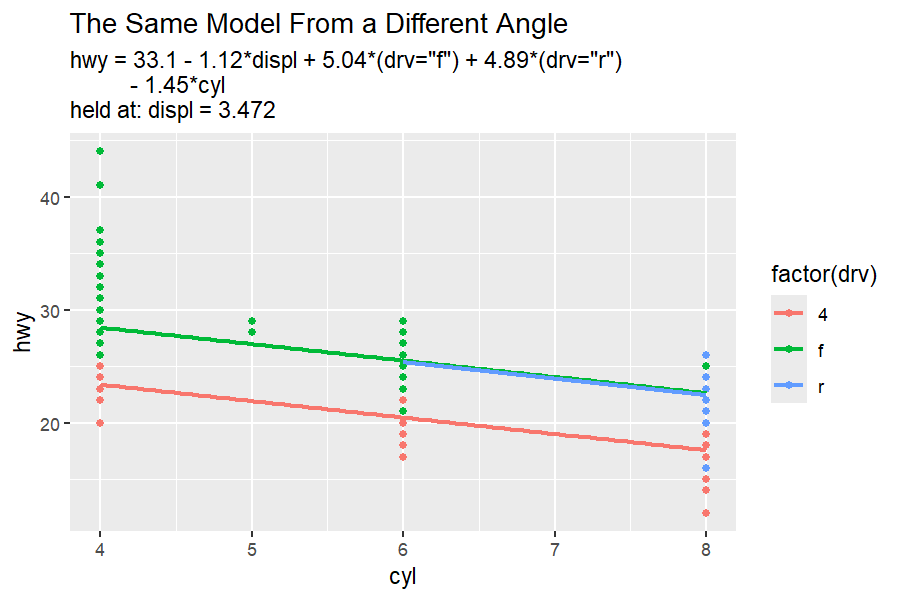

### 3d

`autoplot.lm` can also interactive 3d plotly plots using `type = "3d"`.
Additional arguments pass to `scatter_3d`.

``` r
# Two numeric predictors? Get the interactive 3-D surface instead
autoplot(lm(mpg ~ wt + I(wt^2) + hp, data = mtcars), type = "3d")
```


*(static snapshot — the real plot is interactive: drag to rotate, hover
for values)*

------------------------------------------------------------------------

## `geom_slice()`: your model as a ggplot2 layer

`geom_slice()` draws the prediction line of a fitted `lm()` across your
plot (and its facets). It looks like `geom_smooth()`, but where
`geom_smooth()` fits its own model to the plotted data, `geom_slice()`
draws the model *you* fitted. It is the main driver of `autoplot.lm`,
but makes as few decisions as possible.

As you move beyond a single predictor, `geom_slice()` creates a 2d
“slice” (or slices) of a high-dimensional model. Other predictors are
held at constants, showing what slice of the model you are looking at.
If you don’t specify those values, `geom_slice()` will make a guess as
follows:

- Variables named in `predict_vars` are held at your chosen values.
- Variables mapped to a grouping aesthetic (`aes(color = g)`) are held
  at each group’s value - one line per group.
- Facet variables are held at each panel’s value.
- Anything left over is imputed (mean for numeric, most common value for
  factors), with a console message naming the value used.

In everything, console messages and labeling helpers try to make the
model as clear as possible - so you know exactly what you are looking
at.

In this example, the fitted model with 4 predictors can’t be plotted as
a line without making multiple assumptions. The console messages clarify
the decisions it HAD to make in order to plot the 2d slice.

``` r
set.seed(123)
n <- 80
x <- runif(n, 0.1, 10)
x2 <- runif(n, 0.1, 10)
x3 <- sample(c(1, 20, 40), n, replace = TRUE)
x4 <- sample(c(1, 2), n, replace = TRUE)
y <- log(5 + x + x2 + x3 + 1/5 * x * x3 + 80 * x4) # no random noise
dat <- data.frame(x, x2, x3, x4, y)

model <- lm(exp(y) ~ x*x3 + x2 + x4, data = dat)   # exact model fit

# What geom_slice will do on its own (minimum inference)
ggplot(dat, aes(x, y)) +
  geom_point() +
  geom_slice(model) +
  labs(title = "A Perfectly Fit Model 'Slice'")
#> Value for `x3` not specified - Used mean: 19.36
#>     To choose a slice, use 'predict_vars = list(x3 = 19.36)'.
#> Value for `x2` not specified - Used mean: 4.981
#>     To choose a slice, use 'predict_vars = list(x2 = 4.981)'.
#> Value for `x4` not specified - Used mean: 1.412
#>     To choose a slice, use 'predict_vars = list(x4 = 1.412)'.
#> Predictions of `exp(y)` were back-transformed to match the `y` axis.
#>     To turn this off, use 'back_transform = FALSE'.

# Shows the model is an exact fit (and geom_slice can plot axis transforms)
ggplot(dat, aes(x = log(5 + x + x2 + x3 + 1/5 * x * x3 + 80 * x4), y)) +
  geom_point() +
  geom_slice(model) +
  labs(title = "Same Model, Different X-Axis")
#> Predictions of `exp(y)` were back-transformed to match the `y` axis.
#>     To turn this off, use 'back_transform = FALSE'.
```

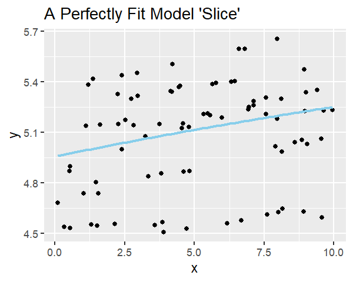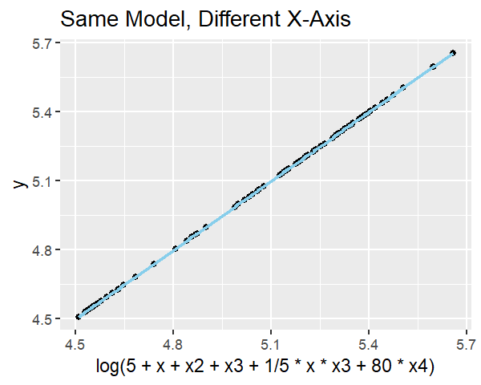

Those assumptions had to be made, but you can make better ones. This
plot shows the same model far clearer by utilizing several features
`geom_slice()` offers.

``` r
ggplot(dat, aes(x, y, color = factor(x3))) +
  geom_point() +
  geom_slice(model, band = "x2", predict_vars = list(x2 = c(0, 10))) +
  facet_wrap(~x4) +
  geom_slice_text() +
  geom_slice_subtitle()
```

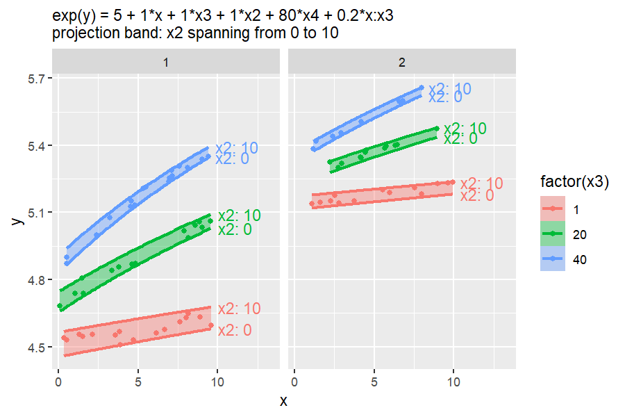

### Choosing slices with `predict_vars`

Give a variable several values to draw one line per value; several
multi-value variables are crossed:

``` r
model <- lm(Sepal.Length ~ Sepal.Width + Petal.Length, iris)

ggplot(iris, aes(Petal.Length, Sepal.Length)) +
  geom_point() +
  geom_slice(
    model, 
    predict_vars = list(Sepal.Width = c(2, 3, 4)),
    interval = "confidence"
  ) +
  geom_slice_text()
```

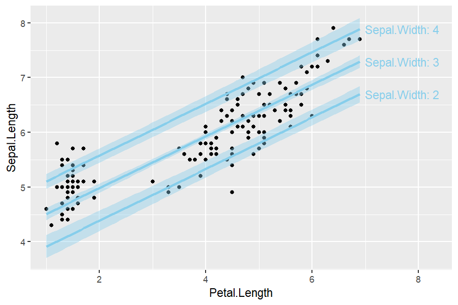

### Confidence and prediction intervals

`interval = "confidence"` or `"prediction"` adds the corresponding
`predict.lm()` ribbon around the line:

``` r
model <- lm(hwy ~ displ + I(displ^2) + displ, data = mpg)

ggplot(mpg, aes(displ, hwy)) +
  geom_point() +
  geom_slice(model, interval = "confidence") +
  labs(title = "Confidence Interval")

ggplot(mpg, aes(displ, hwy)) +
  geom_point() +
  geom_slice(model, interval = "prediction") +
  labs(title = "Prediction Interval")
```

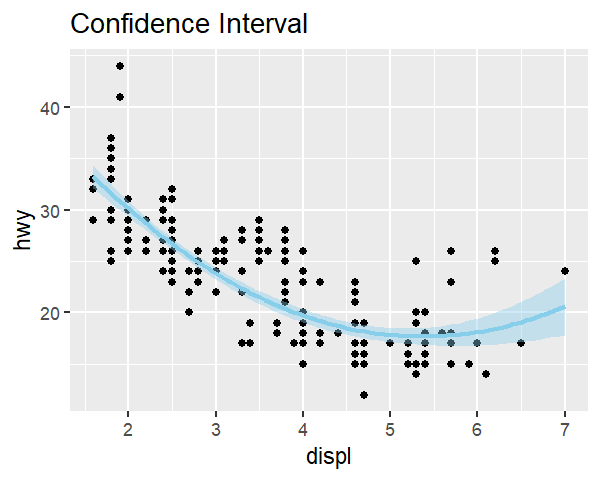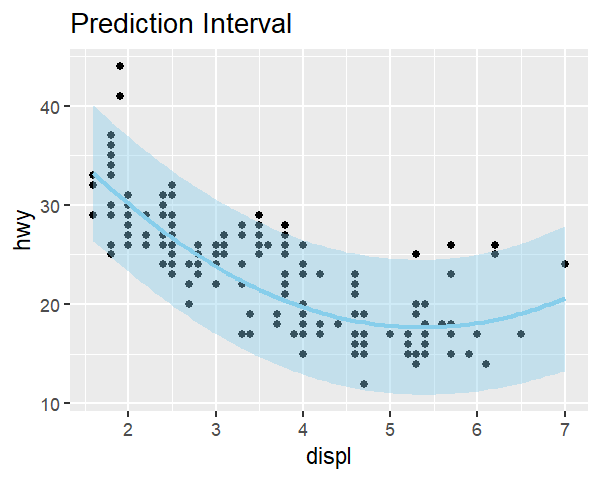

### Projection bands

Where an interval shows uncertainty, `band` shows the *reach of a
predictor*: two edge slices with a translucent ribbon between them.
`band = TRUE` will make a decision about what the band should project
over. `band = "variable"` spans that predictor between the values you
gave in `predict_vars`, or its observed data range when `predict_vars`
leaves it out:

``` r
model <- lm(hwy ~ displ * drv + cyl, data = mpg)

# Projection band infered using the min and max of an unused variable
# In this case: cyl from 4 to 8
ggplot(mpg, aes(displ, hwy, color = drv)) +
  geom_point() +
  geom_slice(model, band = TRUE) +
  geom_slice_text()
```

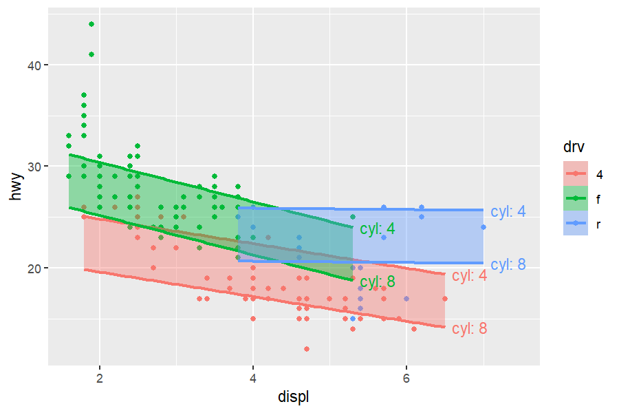

``` r

# This band is specified spanning cyl from 5 to 7
ggplot(mpg, aes(displ, hwy, color = drv)) +
  geom_point() +
  geom_slice(model, band = "cyl", predict_vars = list(cyl = c(5, 7))) +
  geom_slice_text()
```

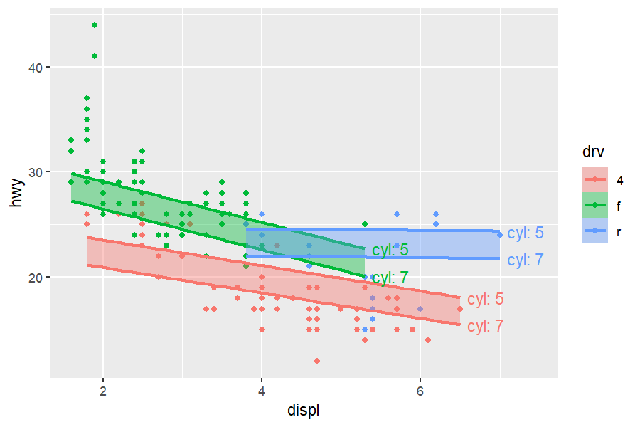

`band = TRUE` infers the variable when there is only one sensible choice
(the one multi-value `predict_vars` entry, or the single predictor the
plot does not otherwise show). `band` cannot be combined with
`interval`.

### Transformed responses

If the model’s response is transformed (e.g. `lm(log(y) ~ x)`) but the
plot shows raw `y`, predictions are back-transformed automatically to
match the y-axis (a message says so). Use `back_transform = FALSE` to
turn this off, or pass a function/name (`exp`, `"log10"`, …) to override
the auto-detection.

``` r
model <- lm(log(mpg) ~ disp + hp, data = mtcars)

ggplot(mtcars, aes(disp, mpg)) +
  geom_point() +
  geom_slice(model) +   # back-transformed onto the raw mpg axis
  labs(title = "normal y axis")

ggplot(mtcars, aes(disp, log(mpg))) +
  geom_point() +
  geom_slice(model) +   # back-transformation adapts to axis
  labs(title = "log() y axis")

ggplot(mtcars, aes(disp, mpg)) +
  geom_point() +
  geom_slice(model) +
  scale_y_log10() +     # resilient to other ggplot axis changes
  labs(title = "scale_y_log10() axis")
```

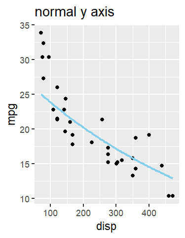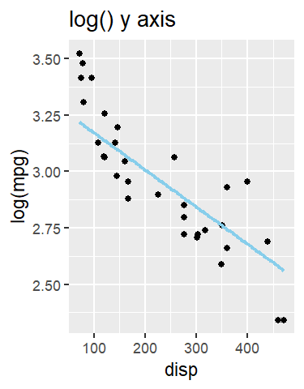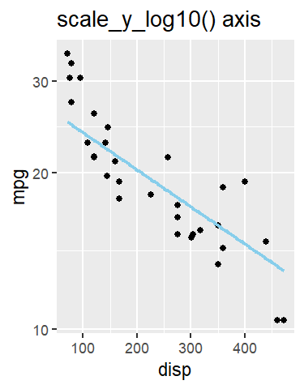

### Grouping: one line per group

Each group’s line normally stops at its own data range.
`full_range = TRUE` extends every line to the edge of the panel instead
(like `fullrange` in `geom_smooth()`):

``` r
model <- lm(hwy ~ displ + I(displ^2) + displ:drv, data = mpg)

# One slice per drv group, capped at the end of each group
ggplot(mpg, aes(displ, hwy, color = drv)) +
  geom_point() +
  geom_slice(model)

# Slice lines extended across the full panel x range with full_range = TRUE
ggplot(mpg, aes(displ, hwy, color = drv)) +
  geom_point() +
  geom_slice(model, full_range = TRUE)
```

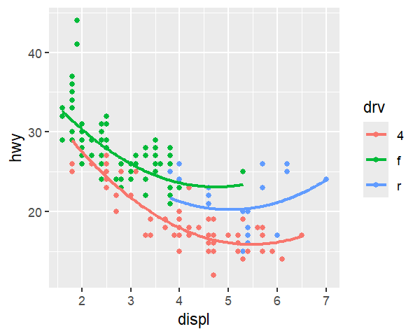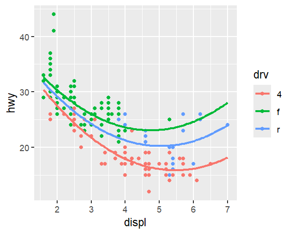

## Labeling the slices

Three companions describe `geom_slice()` lines on the plot itself. They
take no model or `predict_vars` — everything is borrowed from the plot’s
existing `geom_slice()` layers, so add them *after* those layers.

### `geom_slice_text()`

Writes a label at the end of each slice line; especially useful when
`band` or multiple `predict_vars` are specified.

``` r
model <- lm(Sepal.Length ~ Sepal.Width + Petal.Length, iris)

ggplot(iris, aes(Petal.Length, Sepal.Length)) +
  geom_point() +
  geom_slice(model, band = TRUE) +
  geom_slice_text()
```

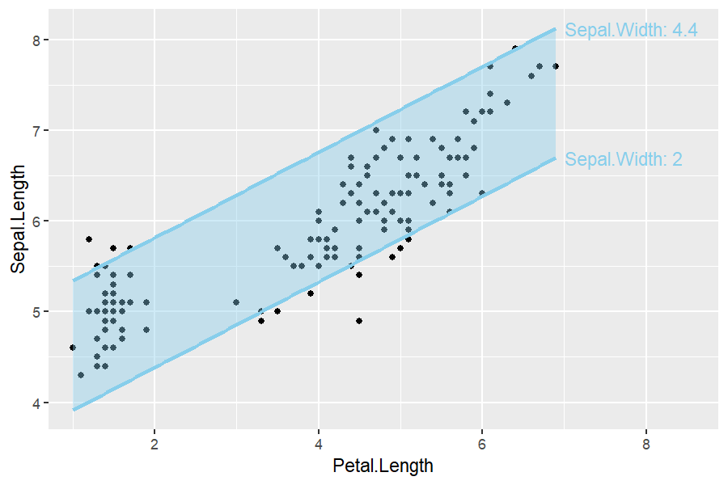

``` r
set.seed(123)

n <- 80
x <- runif(n, -10, 10)
x2 <- runif(n, 0, 4)
g <- factor(sample(c("A", "B"), n, replace = TRUE))
y <- x * ifelse(g == "A", 0.5, 2) + ifelse(g == "A", 5, -5) + 4 * x2 + rnorm(n)
dat <- data.frame(x, g, y)
model <- lm(y ~ x * g + x2, data = dat)

# labels auto-color
ggplot(dat, aes(x, y, color = g)) +
  geom_point(alpha = 0.5) +
  geom_slice(model, predict_vars = list(x2 = c(0, 2, 4))) +
  geom_slice_text()
```

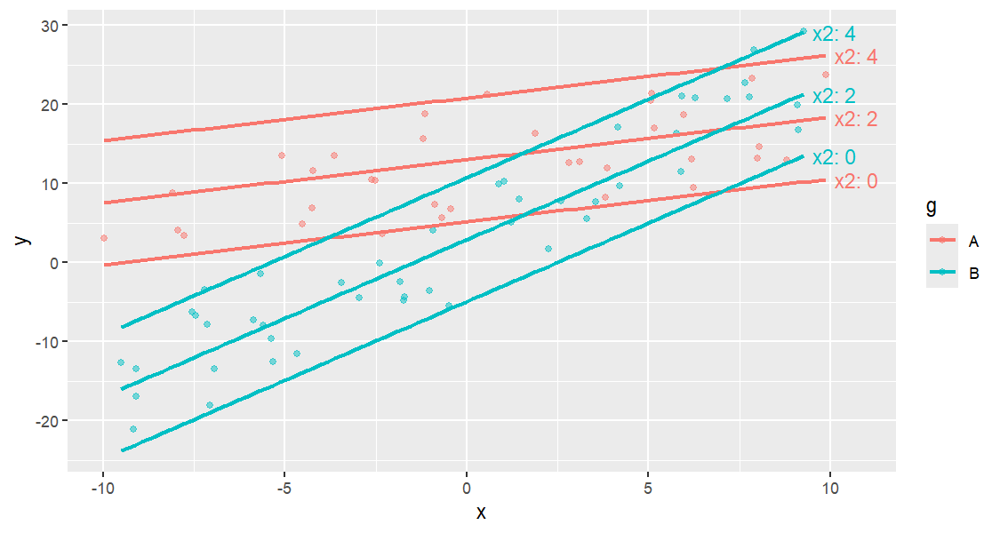

``` r
# Multiple predictors represent one line
ggplot(dat, aes(x, y)) +
  geom_point(alpha = 0.5) +
  geom_slice(model, predict_vars = list(x2 = c(0, 2, 4), g = c("A", "B"))) +
  geom_slice_text()
```

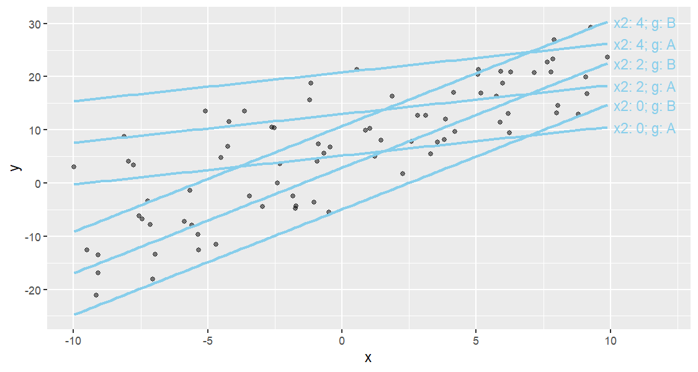

``` r
# Identical, with `style = "legend"`
ggplot(dat, aes(x, y)) +
  geom_point(alpha = 0.5) +
  geom_slice(model, predict_vars = list(x2 = c(0, 2, 4), g = c("A", "B"))) +
  geom_slice_text(style = "legend")
```

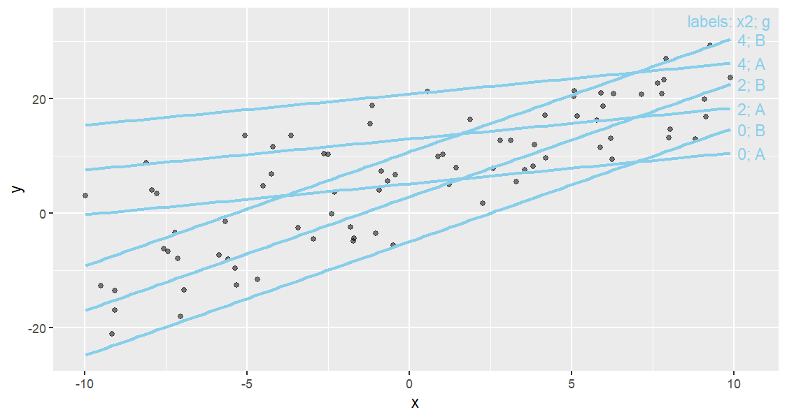

Options: `style` (`"variable"` writes `"hp: 66"`, `"value"` writes bare
values, `"legend"` adds a corner key), `location = "left"`/`"right"`,
`offset`, and `color`.

### `geom_slice_subtitle()` and `geom_slice_caption()`

Fill the plot subtitle (or caption) with the model equation and the held
values the plot does not otherwise show — values already labeled by the
legend, facets, or `geom_slice_text()` are skipped:

``` r
model <- lm(Petal.Length ~ Sepal.Length + I(Sepal.Length^2):Species + Sepal.Width, iris)

ggplot(iris, aes(Sepal.Length, Petal.Length, color = Species)) +
  geom_point() +
  geom_slice(model, interval = "confidence") +
  geom_slice_subtitle()   # or geom_slice_caption()
```

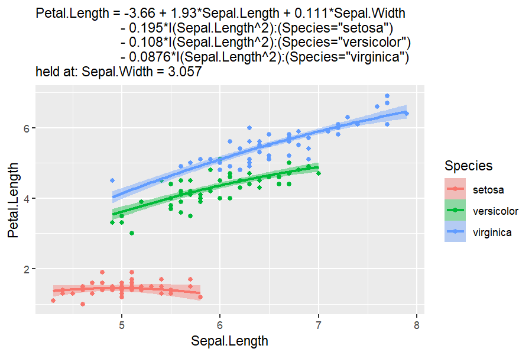

`geom_slice_subtitle()` will go to great lengths to keep the model
readable. It adds indents where there is room, and compresses where
space is tight. `style` changes based on how much space is available.

Both take `model = FALSE` (drop the equation line) and
`prepend`/`append` strings to give you more control. Pass-through
arguments are sent to `lm_equation()`, including `style`.

------------------------------------------------------------------------

## Base R plotting

### `slice_2d()`

Create a new base-R plot showing a 2-D slice of a linear model.
Unspecified `x_axis` defaults to the first variable in the model;
unspecified predictor values are held at sensible defaults (numeric →
mean, factor → first level) and reported in the caption.

``` r
model <- lm(log(mpg) ~ disp + hp, data = mtcars)
slice_2d(model)
#--or--
slice_2d(model, x_axis = "hp", disp = 250, n = 150, col = "blue", lwd = 2)
```

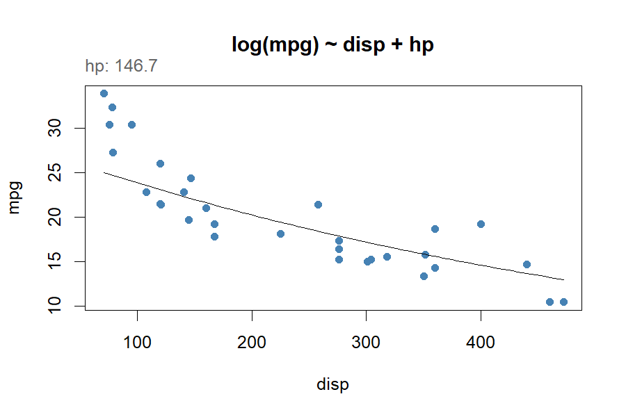

### `add_slice_2d()`

Add a 2-D slice line to an *existing* base-R plot. X and Y axis
variables must match the plot it is being added to.

``` r
model <- lm(log(mpg) ~ disp + hp, data = mtcars)
plot(mpg ~ disp, data = mtcars)
add_slice_2d(model)

# Multiple slices on one plot
plot(mpg ~ disp, data = mtcars)
add_slice_2d(model, hp = min(mtcars$hp), col = "blue")
add_slice_2d(model, hp = max(mtcars$hp), col = "red", lty = 2)
```


------------------------------------------------------------------------

## More tools

### `scatter_3d()`

Create an interactive 3-D scatter plot with a fitted regression surface
(models must have exactly two numeric predictors). Points are colored by
the response along the `colors` gradient, and transformed terms such as
`I(x^2)` graph over their raw predictors. It is also reachable as
`autoplot(model, type = "3d")`.

``` r
model <- lm(mpg ~ wt + I(wt^2) + hp, data = mtcars)
scatter_3d(model)
```

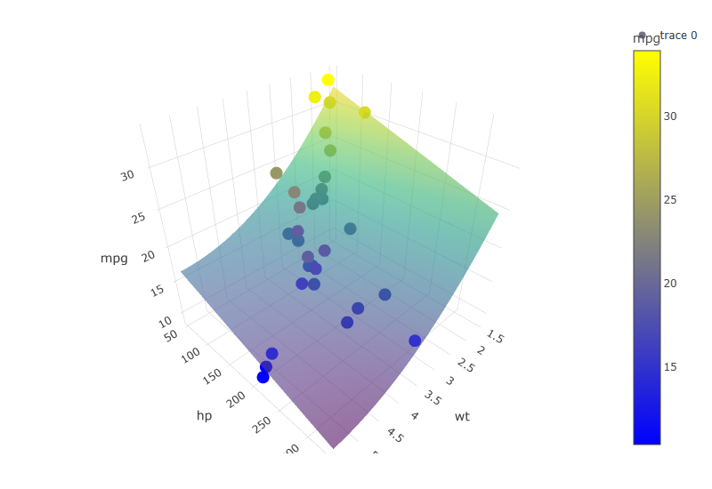

*(static snapshot — the real plot is interactive: drag to rotate, hover
for values)*

### `lm_equation()` and `lm_latex()`

Return the fitted model’s equation as plain text, or print it
LaTeX-formatted (ideal for LaTeX or R Markdown documents). Factor terms
are spelled out readably by default (`style = "prettier"`, e.g.
`(Species="setosa")`); `style = "brackets"` shortens these to the level
alone (`[setosa]`), and `style = "raw"` keeps the design-matrix names
(`Speciessetosa`).

``` r
model <- lm(mpg ~ disp + hp, data = mtcars)
lm_equation(model)
#> [1] "mpg = 30.7 - 0.0303*disp - 0.0248*hp"
lm_latex(model)
#> $$\underbrace{\hat{Y_i}}_{\text{Pred. mpg}} = 30.7 - 0.0303\underbrace{X_{1i}}_{\text{disp}} - 0.0248\underbrace{X_{2i}}_{\text{hp}}$$
```

### `diagnose()`

Draw three base-R diagnostic plots for a model in one call: Residuals vs
Fitted, Normal Q-Q, and the residuals in order.

``` r
model <- lm(mpg ~ wt, data = mtcars)
diagnose(model)
```

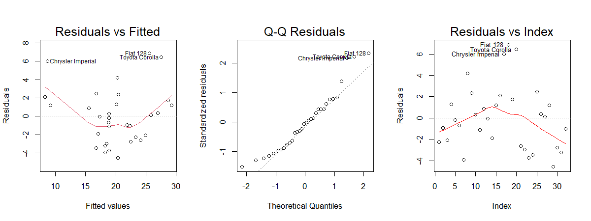

### Advanced: `StatSlice` and `GeomSlice`

Low-level **ggproto** objects that power `geom_slice()`. Most users
never need to call these directly, but you can for custom layers. Note
that `StatSlice` reads the aesthetic mapping from its params —
`geom_slice()` supplies it automatically, but a raw `layer()` call must
pass it explicitly:

``` r
library(ggplot2)
model <- lm(mpg ~ disp + hp + cyl, data = mtcars)

ggplot(mtcars, aes(disp, mpg)) +
  geom_point() +
  layer(stat = StatSlice,
        geom = GeomSlice,
        position = "identity",
        inherit.aes = TRUE,
        params = list(model = model, predict_vars = list(hp = 110),
                      mapping = aes(disp, mpg)))
```

------------------------------------------------------------------------

## Tips

• For multi-variable models, use `predict_vars` (e.g. `list(hp = 110)`)
to choose the slice you want.\
• Factors included in `facet_wrap()` or `facet_grid()` should also
appear in the model you pass to `geom_slice()`.\
• New to R modeling? `lm(y ~ x1 + x2, data = df)` fits a linear model of
`y` on `x1` and `x2`.

## Getting help

• Use R’s built-in help: `?geom_slice`, `?autoplot.lm`, `?slice_2d`,
`?scatter_3d`, etc.\
• Found a bug or have a suggestion? Open an issue at
<https://github.com/saundersg/Applr/issues>.

Enjoy clearer model visualizations with **Applr**!

## Attributions

Thanks to **Cameron McClellan** for his vision and initiation, **James
Beeson** for seeing it through, **Anthropic’s Claude** for solving the
problems we couldn’t, and **Brother Saunders** - our teacher and
inspiration to do great things.

And of course, Brigham Young University Idaho - our alma mater; the
school we love and cherish. And the God of Heaven and Earth, who gives
us all.

33 For God is not the author of *confusion*, but of *peace*, as in all
churches of the saints. - 1 Corinthians 14:33
