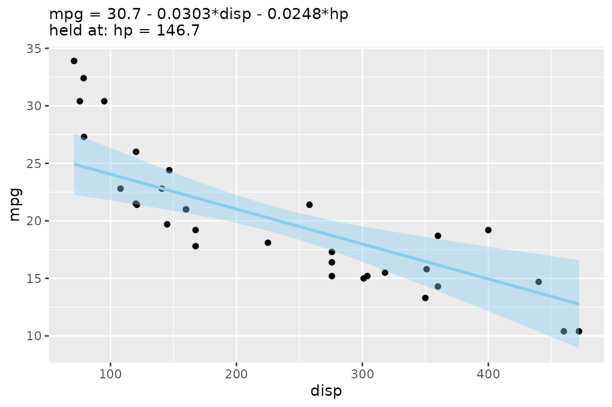
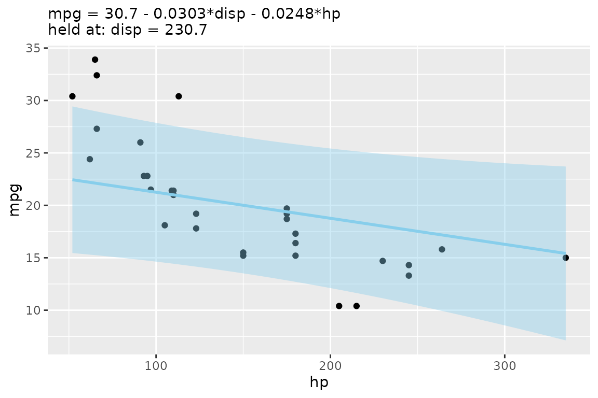
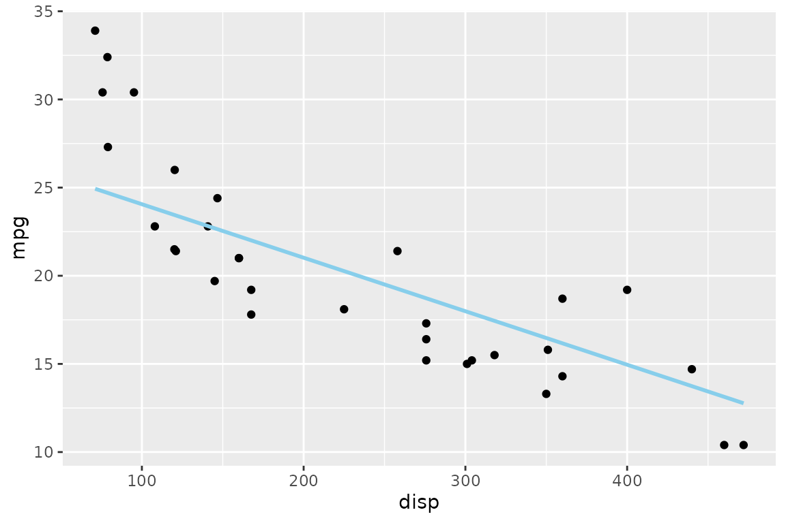
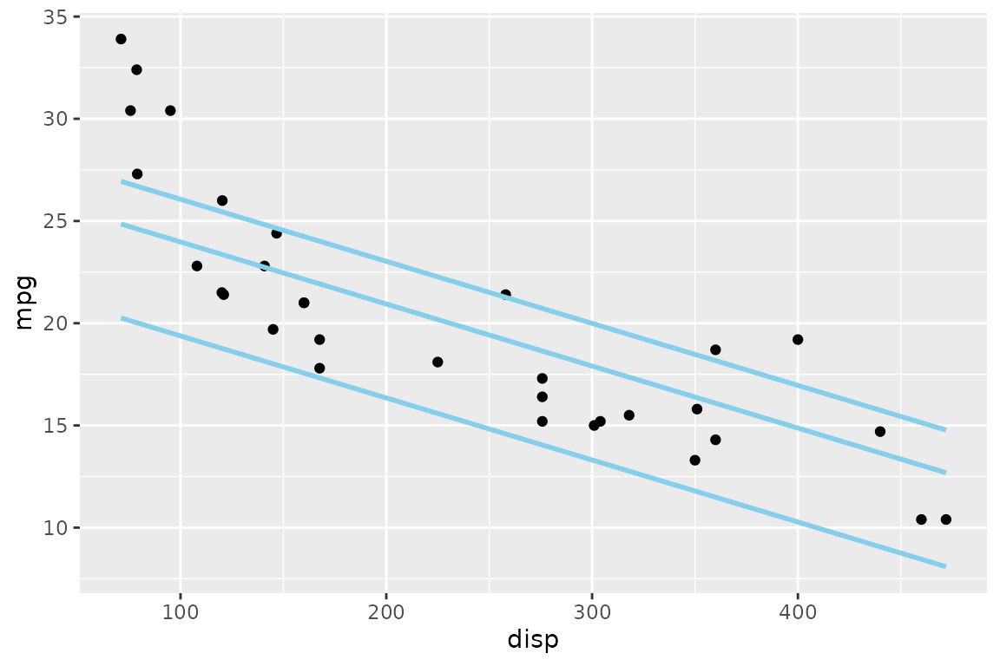
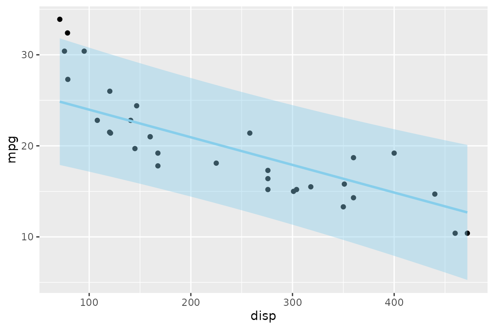
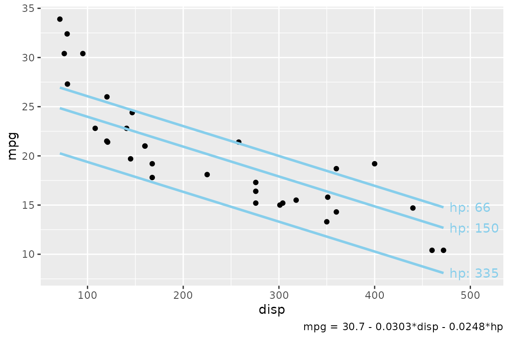
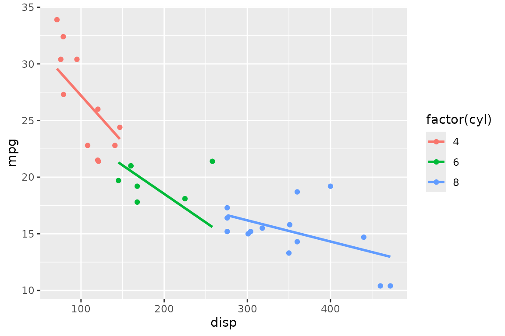

# Getting started with Applr

A fitted linear model with more than one predictor lives in more
dimensions than a scatterplot can show. The usual workaround —
`geom_smooth(method = "lm")` — quietly fits a *different*,
single-predictor model to the plotted variables, so the line on the
screen is not the model you summarized.

Applr draws the model you actually fit. Its core idea is the **slice**:
hold every predictor except one at a fixed value, and draw the model’s
predictions as that one predictor varies. This vignette walks through
the workflow on a single dataset, `mtcars`.

``` r

library(Applr)
library(ggplot2)
```

## Fit a model, then autoplot() it

Start with a model where `mpg` depends on two predictors:

``` r

model <- lm(mpg ~ disp + hp, data = mtcars)
lm_equation(model)
#> [1] "mpg = 30.7 - 0.0303*disp - 0.0248*hp"
```

[`autoplot()`](https://ggplot2.tidyverse.org/reference/autoplot.html) is
the quickest way to see it. It rebuilds the scatterplot from the model’s
own data, picks the first numeric predictor for the x-axis, and adds a
slice line with its confidence ribbon — plus a subtitle recording which
values the other predictors were held at:

``` r

autoplot(model)
#> 
#> Call:
#> lm(formula = mpg ~ disp + hp, data = mtcars)
#> 
#> Residuals:
#>     Min      1Q  Median      3Q     Max 
#> -4.7945 -2.3036 -0.8246  1.8582  6.9363 
#> 
#> Coefficients:
#>              Estimate Std. Error t value Pr(>|t|)    
#> (Intercept) 30.735904   1.331566  23.083  < 2e-16 ***
#> disp        -0.030346   0.007405  -4.098 0.000306 ***
#> hp          -0.024840   0.013385  -1.856 0.073679 .  
#> ---
#> Signif. codes:  0 '***' 0.001 '**' 0.01 '*' 0.05 '.' 0.1 ' ' 1
#> 
#> Residual standard error: 3.127 on 29 degrees of freedom
#> Multiple R-squared:  0.7482, Adjusted R-squared:  0.7309 
#> F-statistic: 43.09 on 2 and 29 DF,  p-value: 2.062e-09
#> Value for `hp` not specified - Used mean: 146.7
#>     To choose a slice, use 'predict_vars = list(hp = 146.7)'.
```



The message tells you what happened: `hp` was not on an axis, so the
line holds it at its mean. Use `mapping = aes(x = ...)` to slice along a
different predictor, and pass any
[`geom_slice()`](https://saundersg.github.io/Applr/reference/geom_slice.md)
argument through `...`:

``` r

autoplot(model, mapping = aes(x = hp), interval = "prediction")
#> 
#> Call:
#> lm(formula = mpg ~ disp + hp, data = mtcars)
#> 
#> Residuals:
#>     Min      1Q  Median      3Q     Max 
#> -4.7945 -2.3036 -0.8246  1.8582  6.9363 
#> 
#> Coefficients:
#>              Estimate Std. Error t value Pr(>|t|)    
#> (Intercept) 30.735904   1.331566  23.083  < 2e-16 ***
#> disp        -0.030346   0.007405  -4.098 0.000306 ***
#> hp          -0.024840   0.013385  -1.856 0.073679 .  
#> ---
#> Signif. codes:  0 '***' 0.001 '**' 0.01 '*' 0.05 '.' 0.1 ' ' 1
#> 
#> Residual standard error: 3.127 on 29 degrees of freedom
#> Multiple R-squared:  0.7482, Adjusted R-squared:  0.7309 
#> F-statistic: 43.09 on 2 and 29 DF,  p-value: 2.062e-09
#> Value for `disp` not specified - Used mean: 230.7
#>     To choose a slice, use 'predict_vars = list(disp = 230.7)'.
```



## Build the plot yourself with geom_slice()

For full control, add
[`geom_slice()`](https://saundersg.github.io/Applr/reference/geom_slice.md)
to an ordinary ggplot. The layer reads the plot’s
[`aes()`](https://ggplot2.tidyverse.org/reference/aes.html) to learn
which predictor is on x, and predicts from your model — no separate
model is fit:

``` r

ggplot(mtcars, aes(x = disp, y = mpg)) +
  geom_point() +
  geom_slice(model)
#> Value for `hp` not specified - Used mean: 146.7
#>     To choose a slice, use 'predict_vars = list(hp = 146.7)'.
```



### Choosing the slice

`predict_vars` pins the off-axis predictors to values you choose instead
of their means. Give a predictor several values and you get one line per
value — a small multiple of slices through the same model:

``` r

ggplot(mtcars, aes(x = disp, y = mpg)) +
  geom_point() +
  geom_slice(model, predict_vars = list(hp = c(66, 150, 335)))
```



### Intervals

`interval = "confidence"` or `"prediction"` shades the corresponding
[`predict.lm()`](https://rdrr.io/r/stats/predict.lm.html) interval
around each line:

``` r

ggplot(mtcars, aes(x = disp, y = mpg)) +
  geom_point() +
  geom_slice(model, predict_vars = list(hp = 150), interval = "prediction")
```



## Labeling the slices

Three companion helpers describe the slices on the plot itself, so a
reader can tell which line is which and what was held constant.

[`geom_slice_text()`](https://saundersg.github.io/Applr/reference/geom_slice_text.md)
labels the end of each line with its held value;
[`geom_slice_caption()`](https://saundersg.github.io/Applr/reference/geom_slice_caption.md)
writes the slice description under the plot:

``` r

ggplot(mtcars, aes(x = disp, y = mpg)) +
  geom_point() +
  geom_slice(model, predict_vars = list(hp = c(66, 150, 335))) +
  geom_slice_text() +
  geom_slice_caption()
```



([`geom_slice_subtitle()`](https://saundersg.github.io/Applr/reference/geom_slice_subtitle.md)
is the third helper — it puts the model equation and held values in the
subtitle, and is what
[`autoplot()`](https://ggplot2.tidyverse.org/reference/autoplot.html)
uses by default.)

## Grouping and faceting

Slices respect the plot’s grouping and faceting. With a model that
includes the grouping variable, each group gets its own correctly-sliced
line:

``` r

model_cyl <- lm(mpg ~ disp * cyl, data = mtcars)

ggplot(mtcars, aes(x = disp, y = mpg, color = factor(cyl))) +
  geom_point() +
  geom_slice(model_cyl)
```



## Where to go next

- [`?geom_slice`](https://saundersg.github.io/Applr/reference/geom_slice.md)
  covers the remaining options: projection bands (`band`), extending
  lines across the panel (`full_range`), transformed responses and
  `back_transform`, and the `n` resolution of the line.
- [`?slice_2d`](https://saundersg.github.io/Applr/reference/slice_2d.md)
  is the base-graphics equivalent of this whole workflow.
- [`?scatter_3d`](https://saundersg.github.io/Applr/reference/scatter_3d.md)
  (or `autoplot(model, type = "3d")`) shows a two-predictor model as an
  interactive 3-D surface instead of a slice.
- [`?lm_equation`](https://saundersg.github.io/Applr/reference/lm_equation.md)
  and
  [`?lm_latex`](https://saundersg.github.io/Applr/reference/lm_latex.md)
  turn the fitted model into text or LaTeX for reports.
